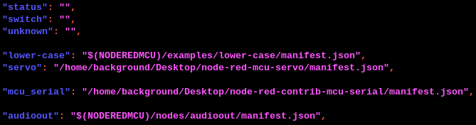

# node-red-contrib-mcu-serial

Node to use serial communication with Node-RED MCU

## Overview

With this node, you can use Serial communication of MCU.  
There are two nodes, Serial in and Serial out.  


## How to use

0. Build the environment for the Node-RED MCU plugin  
1. Install this node  
Add from the "Manage palette" in Node-RED or execute the following command.  

```
cd <directory of where package.json is located>  
npm install <folder_path>  
```

2. Add the path of manifest.json to node_types.json  
(This step may not be necessary because moddable_manifest has been added to the HTML file.  
If you have any problems, please report them to issue)  
node_types.json is located in the directory:  
".node-red/node_modules/@ralphwetzel/node-red-mcu-plugin/node-red-mcu"  
On Raspberry Pi:  
  

3. Try to build with the Node-RED MCU plugin.

## Test case

On Raspberry Pi 400  

- Moddable Two & ESP32
- TX: 17
- RX: 16
- Port: 2
- Baud: 115200

  

Wiring:  
  
  

Sample flows are in the examples folder.  
Flow on MCU:  
  
Flow on Raspberry Pi:  
  

## Acknowledgements

Thanks to [NW-Lab](https://github.com/NW-Lab) and [mshioji](https://github.com/mshioji) for testing use of Serial with function node.  

[@NWLab](https://qiita.com/NWLab):「Node-RED MCUでFunction Nodeを使ったSerial通信をやってみる」  
<https://qiita.com/NWLab/items/5360eff7b8e2685e925a>  

[@mshioji](https://qiita.com/mshioji):"Try Serial Communication with Function Node in Node-RED MCU"  
<https://qiita.com/mshioji/items/98f2ded0481ce3b5d775>  

In Japanese:「Node-RED MCU EditionでSerialを使う」  
<https://qiita.com/mshioji/items/a750a5d713ab4d54c4cf>  

## Other Links

@ralphwetzel/node-red-mcu-plugin  
<https://flows.nodered.org/node/@ralphwetzel/node-red-mcu-plugin>  

@Moddable-OpenSource/moddable  
<https://github.com/Moddable-OpenSource/moddable>  

Node-RED User Group Japan:「ノードの開発」  
<https://nodered.jp/docs/creating-nodes/>  

[@kazuhitoyokoi](https://qiita.com/kazuhitoyokoi):「Node-REDのノードをつくる手順」  
<https://qiita.com/kazuhitoyokoi/items/64ed5b7798197bb6dfdf>  

my article:Creating a servo node that imports an external class  
「Node-RED MCU用のノードを作成してみる　その２（Servoノード）」  
<https://404background.com/program/node-create-2/>  
